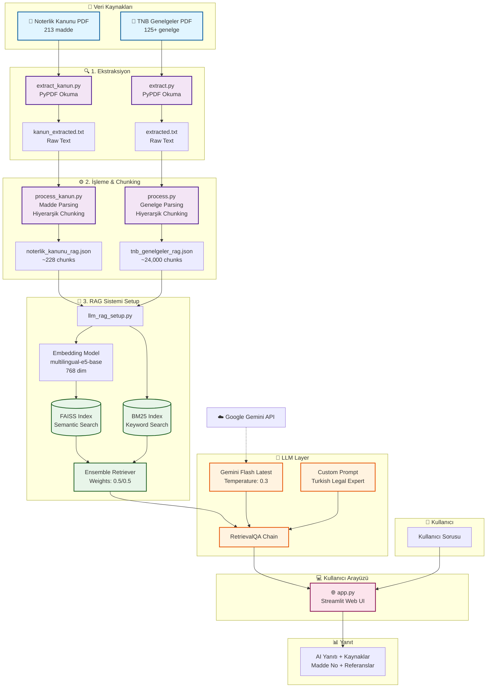

# NoterLLM - Türk Noter Hukuku RAG Sistemi

Noterlik Kanunu ve Türkiye Noterler Birliği genelgelerine dayalı AI destekli soru-cevap sistemi. Retrieval-Augmented Generation (RAG) teknolojisi ile doğru ve kaynak referanslı yanıtlar sunar.

## 🚀 Özellikler

- **Çoklu Kaynak Desteği**: Noterlik Kanunu (1512) + TNB Genelgeleri
- **Hibrit Retrieval**: FAISS (semantic search) + BM25 (keyword search)
- **Hiyerarşik Chunking**: Her chunk kaynak, madde ve kısım bilgisi içerir
- **Kaynak Referansları**: Her yanıtta kanun/genelge madde numarası belirtilir
- **İndeks Önbellekleme**: İlk çalıştırmadan sonra 95% daha hızlı başlatma
- **Web Arayüzü**: Streamlit ile modern kullanıcı deneyimi

## 📋 Gereksinimler

- Python 3.8+
- Gemini API Key ([buradan alınabilir](https://makersuite.google.com/app/apikey))

## 🔧 Kurulum

### 1. Gerekli paketleri yükleyin
```bash
pip install langchain langchain-google-genai langchain-community streamlit \
    faiss-cpu sentence-transformers rank-bm25 pypdf python-dotenv
```

### 2. API Anahtarını Ayarlayın
Kod içinde doğrudan `GEMINI_API_KEY` değişkenine API anahtarınızı yazın veya `.env` dosyası oluşturun:
```bash
echo "GEMINI_API_KEY=your-api-key-here" > .env
```

## 📊 Veri Hazırlama

Projeyi kullanmaya başlamadan önce sırasıyla şu adımları izleyin:

### Genelgeleri Hazırlama
```bash
# 1. Genelge PDF'den metin çıkar
python extract.py

# 2. Metni işle ve chunklara ayır
python process.py
```

### Noterlik Kanununu Hazırlama
```bash
# 1. Kanun PDF'den metin çıkar
python extract_kanun.py

# 2. Kanunu işle ve chunklara ayır
python process_kanun.py
```

### RAG Sistemini Başlatma
```bash
# 3. FAISS ve BM25 indekslerini oluştur (her iki kaynak için)
python llm_rag_setup.py
```

İlk çalıştırmada indekslerin oluşturulması 2-5 dakika sürer. Sonraki çalıştırmalarda mevcut indeksler yüklenir (~5 saniye).

## 💬 Kullanım

### Web Arayüzü (Önerilen)
```bash
streamlit run app.py
```

## 📚 Veri Kaynakları

- **Noterlik Kanunu (1512)**: 213 madde, ~228 chunk
- **TNB Genelgeleri**: 125+ genelge, ~24.000 chunk
- **Toplam**: ~24.200+ chunk ile zengin bilgi tabanı

## 🔍 Teknik Detaylar

- **Embedding Model**: `intfloat/multilingual-e5-base` (768 dim, Türkçe destekli)
- **LLM**: Gemini Flash Latest (Temperature: 0.3)
- **Retrieval**: Ensemble (FAISS + BM25, Top-K: 5)
- **Chunking**: 1500 karakter, 200 overlap

## 🏗️ Sistem Mimarisi



### Mimari Akış Açıklaması

1. **📥 Veri Girişi**: PDF formatındaki Noterlik Kanunu ve TNB Genelgeleri sisteme yüklenir
2. **🔍 Ekstraksiyon**: PyPDF ile PDF'lerden düz metin çıkarılır
3. **⚙️ İşleme**: Metinler maddelere ayrılır ve 1500 karakter chunklar halinde yapılandırılır (200 karakter overlap)
4. **🧠 Vektörizasyon**: Her chunk Türkçe destekli embedding model ile vektöre dönüştürülür
5. **🗂️ İndeksleme**: FAISS (semantic) ve BM25 (keyword) ile çift indeks oluşturulur
6. **🔍 Retrieval**: Kullanıcı sorusu geldiğinde ensemble retriever ile en ilgili 5 chunk bulunur
7. **🤖 LLM İşleme**: Gemini Flash, bulunan chunklar ve özel prompt ile yanıt üretir
8. **📊 Sunum**: Kaynak referansları ile birlikte Streamlit arayüzünde kullanıcıya sunulur

## 🐛 Sorun Giderme

| Problem | Çözüm |
|---------|-------|
| "GEMINI_API_KEY not found" | `.env` dosyası oluşturun veya kodda API anahtarını ayarlayın |
| "tnb_genelgeler_rag.json not found" | Veri hazırlama adımlarını sırasıyla çalıştırın |
| FAISS indeksi yüklenemiyor | `faiss_index/` klasörünü silin ve yeniden oluşturun |
| Out of Memory | `llm_rag_setup.py` içinde batch_size'ı azaltın |

---

**Not**: Bu sistem genelgelere dayalı bilgi sağlar ancak resmi hukuki danışmanlık yerine geçmez. Önemli kararlar için mutlaka yetkili mercilere danışın.

