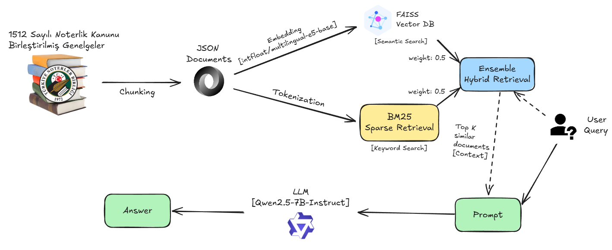

# NoterLLM - Türk Noter Hukuku RAG Sistemi

Noterlik Kanunu ve Türkiye Noterler Birliği genelgelerine dayalı AI destekli soru-cevap sistemi. Retrieval-Augmented Generation (RAG) teknolojisi ile doğru ve kaynak referanslı yanıtlar sunar.

## 🚀 Özellikler

- **Çoklu Kaynak Desteği**: Noterlik Kanunu (1512) + TNB Genelgeleri
- **Hibrit Retrieval**: FAISS (semantic search) + BM25 (keyword search)
- **Hiyerarşik Chunking**: Her chunk kaynak, madde ve kısım bilgisi içerir
- **Kaynak Referansları**: Her yanıtta kanun/genelge madde numarası belirtilir
- **İndeks Önbellekleme**: İlk çalıştırmadan sonra 95% daha hızlı başlatma
- **Web Arayüzü**: Gradio ile minimalist ve kolay kullanıcı deneyimi

## 📋 Gereksinimler

- Python 3.8+
- HuggingFace Access Token

## 🔧 Kurulum

### 1. Gerekli paketleri yükleyin
```bash
pip install -r requirements.txt
```

### 2. HuggingFace Token Ayarlayın
```bash
echo "HF_TOKEN=your_huggingface_token" > .env
```

## 📊 Veri Hazırlama

Projeyi kullanmaya başlamadan önce sırasıyla şu adımları izleyin:

### Genelgeleri Hazırlama
```bash
# 1. Genelge PDF'den metin çıkar
python extract.py

# 2. Metni işle ve chunklara ayır
python process.py
```

### Noterlik Kanununu Hazırlama
```bash
# 1. Kanun PDF'den metin çıkar
python extract_kanun.py

# 2. Kanunu işle ve chunklara ayır
python process_kanun.py
```

### RAG Sistemini Başlatma
```bash
# 3. FAISS ve BM25 indekslerini oluştur (her iki kaynak için)
python llm_rag_setup.py
```

İlk çalıştırmada indekslerin oluşturulması 2-5 dakika sürer. Sonraki çalıştırmalarda mevcut indeksler yüklenir (~5 saniye).

## 💬 Kullanım

### Web Arayüzü
```bash
python app.py
```

## 📚 Veri Kaynakları

- **Noterlik Kanunu**
- **TNB Genelgeleri**

## 🔍 Teknik Detaylar

- **Embedding Model**: `intfloat/multilingual-e5-base` (768 dim, Türkçe destekli)
- **LLM**: Qwen2.5-7B-Instruct
- **Retrieval**: Ensemble (FAISS + BM25, Top-K: 5)
- **Chunking**: 1500 karakter, 200 overlap

## 🏗️ Sistem Mimarisi



---

**Not**: Bu sistem genelgelere dayalı bilgi sağlar ancak resmi hukuki danışmanlık yerine geçmez. Önemli kararlar için mutlaka yetkili mercilere danışın.

